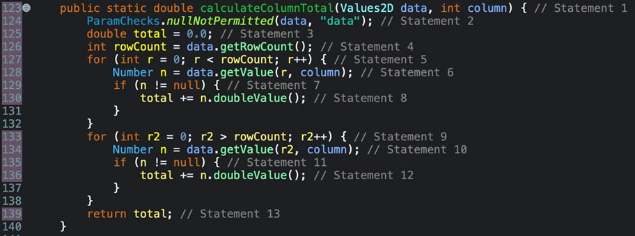
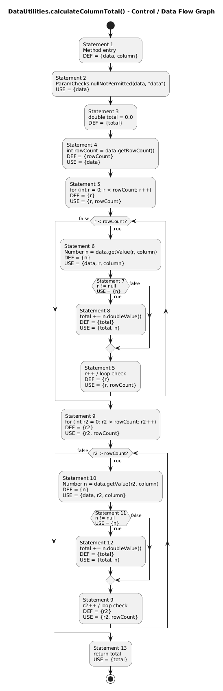
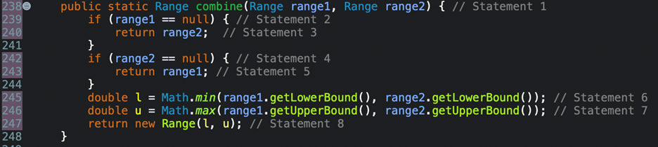
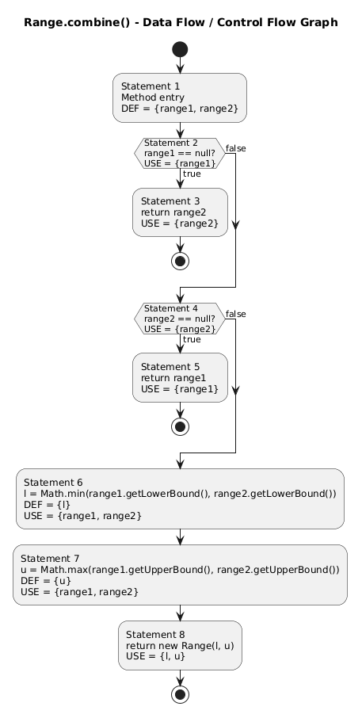
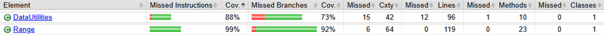

**SENG 637 - Dependability and Reliability of Software Systems**

**Lab. Report #3 – Code Coverage, Adequacy Criteria and Test Case Correlation**

| Group \#: 12     |
| ---------------- |
| Student Names:   |
| Jason Chiu       |
| William Watson   |
| Jack Shenfield   |
| Barrett Sapunjis |

# 1 Introduction
The focus of this lab is to become familiar with and apply white-box testing methods and code coverage analysis using the JUnit testing framework in Eclipse and coverage analysis tools. Unlike the previous lab which emphasized black-box testing based on input domains and expected outputs, this lab evaluates the efficacy of the testing suite by how much of the code (coverage) is exercised during testing as well as how data flow testing may be accomplished through manual means. Now with the source code available, aspects of control-flow coverage, namely statement, branch, and condition coverage, are used to further provide testing insight on the system under test (SUT) in addition to the previous lab's black-box testing.

Like the previous lab, the SUT tested in this lab is JFreeChart, an open-source Java library used for creating charts and data visualizations. Similarly, the `Range` and `DataUtilities` classes are analyzed in this lab. The test suite developed in the previous lab was imported and executed using **EclEmma**[JC1.1], which was verified with **openClover**, a more updated version of the recommended Clover coverage analysis tool. In addition to the automated testing, manual data-flow testing was done to better understand the concept of definition-use (D-U) pairs. Data-flow graphs were created for the selected methods, as well as multiple tables relating these D-U pairs to statements, variables, and test cases.

# 2 Manual data-flow coverage calculations for chosen methods

## Method I: `DataUtilities.calculateColumnTotal(Values2D, int) : double`

This method has two input variables of type `Values2D` and `int`, and outputs a `double`. It is used to calculate the sum of a column of a `Values2D` array. Empty lines or lines with opening or closing braces were ignored for the data flow graph, thus there were 13 statements in total. Through this annotation, it was found that Statement 9 (`r2 > rowCount`) would always be false (`r2` is initialized at 0 and `rowCount` is only non-negative), thus statements 10, 11, and 12 would never execute.

**Figure 1:** DataUtilities.calculateColumnTotal function annotated with statement numbers  

**Figure 2:** Data Flow Graph for DataUtilities.calculateColumnTotal  

#### Table 1: Def-Use Sets per Statement for `DataUtilities.calculateColumnTotal`

| Statement | Def | Use |
|-----------|-----|-----|
| 1 | data, column (parameter definition) | - |
| 2 | - | data |
| 3 | total | - |
| 4 | rowCount | data |
| 5 | r | r, rowCount |
| 6 | n | data, r, column |
| 7 | - | n |
| 8 | total | total, n |
| 9 | r2 | r2, rowCount |
| 10 | n | data, r2, column |
| 11 | - | n |
| 12 | total | total, n |
| 13 | - | total |

Using the previous table, the following feasible D-U pairs per variable can be created:

#### Table 2: Def-Use Pairs per Variable for `DataUtilities.calculateColumnTotal`

| Variable | Feasible D-U Pairs |
|----------|------------------|
| data | (1, 2), (1, 4), (1, 6) |
| column | (1, 6) |
| total | (3, 8), (3, 13), (8, 8), (8, 13) |
| rowCount | (4, 5), (4, 9) |
| r | (5, 5), (5, 6) |
| n | (6, 7), (6, 8) |
| r2 | (9, 9) |

Where the infeasible D-U pairs per variable are as follows:

#### Table 3: Infeasible D-U Pairs for `DataUtilities.calculateColumnTotal`

| Variable | Infeasible D-U Pairs |
|----------|--------------------|
| data | (1, 10) |
| column | (1, 10) |
| total | (3, 12), (8, 12), (12, 12), (12, 13) |
| n | (10, 11), (10, 12) |
| r2 | (9, 10) |

By analyzing the flow of each test function, the following table was made (Only feasible D-U pairs can be tested):

#### Table 4: Pairs Covered by each Test Case

| Test Case | D-U Pairs Covered |
|-----------|-----------------|
| testCalculateColumnTotalNullDataset() | (1,2) |
| testCalculateColumnTotalAllNullCells() | (1,2), (1,4), (1,6), (3,13), (4,5), (4,9), (5,5), (5,6), (6,7), (9,9) |
| testCalculateColumnTotalEmptyTable() | (1,2), (1,4), (3,13), (4,5), (4,9), (9,9) |
| testCalculateColumnTotalSingleRow() | (1,2), (1,4), (1,6), (3,8), (8,13), (4,5), (4,9), (5,5), (5,6), (6,7), (6,8), (9,9) |
| testCalculateColumnTotalMultipleRows() | (1,2), (1,4), (1,6), (3,8), (8,8), (8,13), (4,5), (4,9), (5,5), (5,6), (6,7), (6,8), (9,9) |
| testCalculateColumnTotalNegativeColumn() | (1,2), (1,4), (1,6), (4,5), (5,5), (5,6) |
| testCalculateCOlumnTotalTooLargeMocked() | (1,2), (1,4), (1,6), (4,5), (5,5), (5,6) |

Thus, all 15 feasible D-U pairs are shown to be covered by the test suite.

---

## Method II: `Range.combine(Range, Range) : Range`

The chosen method for manual DU analysis from the `Range` class is the combination method which has two input variables of type `Range` object and outputs a type `Range` object. It is used to combine two Ranges into and outputted as one. Once again, empty lines or lines with opening or closing braces were ignored for the data flow graph as annotated in the figure below, giving us 8 statements in total.

**Figure 3:** Range.combine function annotated with statement numbers  

**Figure 4:** Data Flow Graph for Range.combine  

#### Table 5: Def-Use Sets per Statement for `Range.combine`

| Statement | Def | Use |
|-----------|-----|-----|
| 1 | range1, range2 (parameter definition) | - |
| 2 | - | range1 |
| 3 | - | range2 |
| 4 | - | range2 |
| 5 | - | range1 |
| 6 | l | range1, range2 |
| 7 | u | range1, range2 |
| 8 | - | l, u |

Using the def-use sets in Table 5, the following pairs per variable can be created:

#### Table 6: Def-Use Pairs per Variable for `Range.combine`

| Variable | D-U Pairs |
|----------|-----------|
| range1 | (1, 2), (1, 5), (1, 6), (1, 7) |
| range2 | (1, 3), (1, 4), (1, 6), (1, 7) |
| l | (6, 8) |
| u | (7, 8) |

By analyzing the flow of each test function, the following table was made:

#### Table 7: Pairs Covered by each Test Case for `Range.combine`

| Test Case | D-U Pairs Covered |
|-----------|-----------------|
| testCombineBothNull() | (1, 2), (1, 3) |
| testCombineFirstNull() | (1, 2), (1, 3) |
| testCombineSecondNull() | (1, 2), (1, 4), (1, 5) |
| testCombineOverlapping() | (1, 2), (1, 4), (1, 6), (1, 7), (6, 8), (7, 8) |
| testCombineDisjoint() | (1, 2), (1, 4), (1, 6), (1, 7), (6, 8), (7, 8) |
| testCombineContained() | (1, 2), (1, 4), (1, 6), (1, 7), (6, 8), (7, 8) |

Thus, all 10 D-U pairs are shown to be covered by the test suite.

# 3 Detailed description of the testing strategy for the new unit test

## Objective

The purpose of this testing strategy is to increase code coverage of the `Range` and `DataUtilities` classes through the addition of white-box testing to complement the previous black-box testing test suite for a more complete understanding of the SUT code. More specifically, the goals are as follows:

- Identify untested or partially tested methods and paths in each class.
- Design new unit tests to exercise all executable statements (where possible), decision branches, and key conditions.
- Ensure that the test suite aligns with the requirements of the JFreeChart API and produces correct expected results.
- Document and measure coverage results using **EclEmma** as the primary code coverage tool.

## Approach

The approach combines white-box testing techniques with a review of the existing black-box tests from Assignment 2. The strategy includes:

1. **Analysis of existing tests:** Examine the previous test suite to identify which methods and branches are already exercised.
2. **Identification of gaps:** Using coverage reports, determine which statements and branches remain untested or have limited testing in each class.
3. **Test prioritization:** Focus first on methods with high complexity and untested branches to maximize the impact of new tests and increase coverage the fastest.
4. **Incremental test development:** Develop new test cases in small increments, running them individually after a new unit test is developed, and in combination with existing tests to verify correctness and increase coverage metrics.
5. **Peer review:** After initial implementation, tests are reviewed by team members to detect inconsistencies or missing cases.

## Test Case Design

Each new test case is designed according to the following considerations:

1. **One test per control flow path:** Each test method targets a specific path through the method under test, e.g., positive vs negative input, edge cases, or exception conditions.
2. **Coverage-based selection:** Test inputs are chosen specifically to exercise untested statements or branches.
3. **Descriptive naming:** Each test method name reflects the scenario it tests, e.g., `testRangeLowerGreaterThanUpper()` or `testCalculateColumnTotalValidRows()`.
4. **Integration with existing tests:** New tests complement the existing black-box tests; existing tests are not modified, only extended if additional coverage is required.

## Logistics

- **Team division:** The team of four divides the methods across members to ensure all methods are tested efficiently.  
  - Two members focus on `Range.java`, two on `DataUtilities.java`.  
  - Each class is further broken down into the methods that need remaining coverage to be worked on as a split in each pairing.  
- **Development environment:** Eclipse IDE with EclEmma plugin for coverage measurement.  
- **Version control:** All tests added to the Git repository to track changes and facilitate collaboration.  
- **Execution process:**  
  1. Add unit tests to the project test files.  
  2. Run coverage analysis for the specific class.  
  3. Record statement, branch, and method coverage percentages.  
  4. Adjust/add tests if coverage targets are not met.  

## Deliverables

- **Enhanced test suite:** JUnit test files covering all methods and untested branches in `Range.java` and `DataUtilities.java` which will now include the original unmodified black-box testing and the addition of new white-box testing unit tests.  
- **Coverage report:** Screenshots and tables showing updated coverage percentages for statement, branch, and condition coverage.  
- **Documentation:**  
  - High-level description of five selected test cases (with rationale for selection).  
  - Notes on which paths were specifically targeted to increase coverage.  
  - Any difficulties encountered in achieving coverage and solutions applied (e.g., handling NaN, exceptions, or untestable code paths).  

# 4 Description of five selected test cases designed using coverage information, and how they have increased code coverage

After executing the existing test suite with EclEmma, coverage reports indicated that several methods and branches within the `Range` and `DataUtilities` classes were either partially covered or not executed at all. To improve statement and branch coverage, additional white-box unit tests were designed specifically to target these uncovered areas. Five representative test cases that resulted in the greatest increase in code coverage (ignoring too similar/same method unit tests) are described below.

### Test Case 1: `testCombineIgnoringNaNNormal()`
**Target method:** `Range.combineIgnoringNaN(Range r1, Range r2)`

Coverage analysis of this method showed that there were no tests in the original black-box test suite targeting this method, resulting in the most significant gain in coverage from the addition of this test. In particular, using valid `Range` objects rather than null inputs allowed the test to exercise the primary execution path of the method and evaluate the logic used to combine the lower and upper bounds of the input ranges. This verified multiple statements and decision branches within the method. In contrast, tests involving null parameters typically terminate early due to validation checks and therefore cover fewer execution paths. Additionally, because this method internally relies on other helper logic, through the min and max private class functions within the `Range` class, executing this test indirectly exercised functionality that would not have been explicitly identified or targeted using black-box testing alone. This highlights the benefit of white-box testing, where knowledge of internal implementation enables tests to trigger additional internal logic and improve overall coverage.

### Test Case 2: `testGetLowerBoundInvalidState()`
**Target Method:** `Range.getLowerBound()`

The `getLowerBound()` method previously had no direct tests. Although it was indirectly executed by tests for other methods in the `Range` class, its internal logic was not explicitly verified, resulting in limited coverage. This test increases condition and branch coverage by deliberately creating an invalid internal state for the `Range` object and verifying that the method throws the expected exception. By forcing the method to execute its defensive validation logic, this test ensures that the error-handling behaviour of the method is exercised and verified.

### Test Case 3: `testHashCode()`
**Target Method:** `Range.hashCode()`

The `hashCode()` method had no prior coverage in the original test suite. Although the method appears relatively simple at first glance, its implementation contains several statements and calculations used to generate a deterministic hash value based on the bounds of the range. As a result, executing this method covers multiple operations involved in the hash computation. The `testHashCode()` test creates a valid `Range` object and invokes the `hashCode()` method to verify that a consistent hash value is returned. Due to the structure of the method, a single test execution is sufficient to execute all statements within the method and achieve full statement coverage. This demonstrates that even seemingly simple methods can contain multiple internal operations that benefit from explicit testing to ensure full coverage.

### Test Case 4: `testCloneValidArray()`
**Target Method:** `DataUtilities.clone(double[][] source)`

Coverage analysis showed that the `clone()` method in the `DataUtilities` class was not previously tested. Several tests were implemented to increase coverage of this method and verify its behaviour under different input conditions. The `testCloneValidArray()` test improves statement and condition coverage by supplying a valid two-dimensional array and verifying that the function successfully returns a cloned array without throwing exceptions. The test also verifies that the returned array contains the same values as the original array while representing a distinct object in memory. While this test increases coverage, it only exercises one of several possible input conditions for the method.

### Test Case 5: `testEqualBothNull()`
**Target Method:** `DataUtilities.equal(Values2D data1, Values2D data2)`

The coverage report indicated that the `equal()` method also lacked prior coverage in the original test suite. Multiple tests were required to exercise the different branches within this method. The `testEqualBothNull()` test specifically targets the branch where both input parameters are null, verifying that the method correctly handles this edge case and returns the expected result. This test ensures that the method’s null-handling logic is executed and contributes to increasing both statement and branch coverage for the method.

Overall, the original test suite developed in the previous assignment already covered a good portion of the selected methods. However, several methods still lacked tests in general, and some for important conditions and execution paths. By performing coverage analysis with EclEmma, it was possible to identify precisely where coverage was insufficient. The additional tests described above were implemented to target these gaps and increase both statement and branch coverage.

# 5 Coverage achieved of each class and method

Using EclEmma for Statement (Instruction) and Branch coverage, and OpenClover for condition coverage, the following table of results was obtained:

#### Table 8: Coverage Analysis results for DataUtilities and Range test suites**

| Coverage Type | Covered Count | Total Count | Coverage Percentage |
|---------------|---------------|-------------|-------------------|
| DataUtilities: Statement (Instruction) Coverage | 351 | 396 | 88.6% |
| DataUtilities: Branch Coverage | 47 | 64 | 73.4% |
| DataUtilities: Condition Coverage | 108 | 126 | 85.7% |
| Range: Statement (Instruction) Coverage | 558 | 560 | 99.6% |
| Range: Branch Coverage | 76 | 82 | 92.7% |
| Range: Condition Coverage | 63 | 64 | 98.4% |

 

**Figure 5:** EclEmma Displayed Instruction and Branch Coverages

**Statement Coverage Comments:**  
With a minimum requirement of 90% for statement coverage, the representative instruction coverage from EclEmma showed our `Range` tests far exceeded this with 99.6% while the `DataUtilities` tests fell short at 88.6%. While many attempts were made to try to reach 90% in the `DataUtilities` test, in the end, due to a portion of dead unreachable code in many of the classes’ functions, it could not be achieved. This, however, highlights the effectiveness in white box testing in the general sense of better capturing where and what code may be redundant or even pointless and so while the minimum coverage for this case could not be achieved, being able to identify these design flaws is mainly what testing is all about.

**Branch Coverage Comments:**  
For branch coverage, the goal to reach was 70% of which both class test suites were able to reach. While `DataUtilities’` coverage appears lower in comparison to `Range` coverage, this was once again due to certain branches that were produced in the dead code that were impossible to reach. The effective branches, however, were tested at a relatively high coverage upon a more thorough look at the analysis when using the tool.

**Condition Coverage Comments:**  
The aim for condition coverage was 60% and as the results show, this was exceeded to a good extent for both class test suites. Unlike the other two coverage types, condition coverage could not be obtained by EclEmma and required the use of another coverage tool, OpenClover. The results also differed as no visual bar and numerical coverage percentage was given. Instead review of a full analysis `.xml` was required where manual calculation for condition coverage was derived from dividing covered conditions by total counted conditions by OpenClover. Once again, from these results `DataUtilities` coverage falls short in comparison to `Range` coverage due to the dead code which involved some loops and if else statements.

# 6 Pros and Cons of coverage tools used and Metrics Reported

The two coverage tools used were EclEmma and OpenClover. EclEmma was easier to set up, particularly when working directly within Eclipse. However, we could not rely solely on EclEmma for the report because it does not provide a condition coverage metric. As a result, we implemented OpenClover through a Maven-based project.  
A drawback of OpenClover was its limited compatibility with Eclipse in our setup. Although documentation suggests Eclipse integration is possible, and an installation process exists, we ultimately had to use a CLI-based approach. When OpenClover was executed, it generated an XML file containing lower-level coverage metrics. This file reported the number of condition branches present in the code and how many of them were covered by the tests. Once the project was properly configured with Maven, some team members preferred using the OpenClover CLI workflow, while others preferred the simplicity of EclEmma. Overall, we concluded that EclEmma was the more practical tool for our workflow.  

Regarding the relevant metrics (statement, branch, and condition coverage), each serves a different role and together they form a hierarchy of testing granularity. Statement coverage is useful to developers because it shows exactly which lines of code were executed and which were not. This allows developers to quickly identify areas that require additional tests or modifications. Branch coverage was the least informative in our experience because it indicates which branches were executed but does not provide substantially different insight compared to statement coverage. In many cases, both metrics reveal similar information about which parts of the code were not executed, without explaining the underlying cause. Condition coverage, however, offers a much more fine-grained view of program behavior. Although the results may be more complex to interpret, condition coverage can reveal specific logical cases that are not being tested and help identify gaps in test redundancy.

# 7 Comparison on the advantages and disadvantages of requirements-based test generation and coverage-based test generation

Requirements-based test generation and coverage-based test generation represent two different approaches to designing test cases. Requirements-based testing focuses on verifying that the software behaves according to its documented specifications, while coverage-based testing focuses on ensuring that the internal structure of the code is thoroughly exercised.  

One advantage of requirements-based testing is that it is straightforward and directly aligned with the intended functionality of the system. Tests are derived from the documented requirements, meaning each test verifies that a specific expected behavior is correctly implemented. This makes the tests easier to design and easier to justify, since each test case corresponds to a clearly defined requirement. However, a disadvantage of this approach is that it may overlook edge cases or internal execution paths that are not explicitly described in the documentation. As a result, even if all requirement-based tests pass, portions of the code may remain untested.  

On the other hand, coverage-based test generation focuses on analyzing how much of the program’s internal structure is exercised during testing. Tools such as EclEmma can highlight statements, branches, or conditions that are never executed by the existing tests. This allows developers to identify gaps in the test suite and design additional tests to improve coverage. The advantage of this approach is that it exposes hidden execution paths and edge cases that requirements-based tests may miss. However, the main disadvantage is that coverage-based testing does not necessarily verify that the software satisfies its intended requirements. It is possible to achieve high coverage while still failing to test the correct functional behavior.  

In practice, these two approaches are complementary. Requirements-based testing ensures that the system behaves according to its specifications, while coverage-based testing helps reveal untested code paths and potential edge cases. Using both approaches together results in a completer and more reliable test suite.

# 8 Discussion on team work/effort division and management

The team had a preliminary meeting to decide how to split up the work. Two people worked on one function each for the manual coverage calculations, whereas the other two worked on designing the strategy test plan for the new white box unit tests. The actual unit test design was then split into the two classes, `Range` and `DataUtilities`, and then further into methods with remaining missing coverage with work split between the two pairs and the individuals in each pair respectively. Once the test design and results were achieved, review of each other’s pairings work was done and finally, the team worked together to finish the final report.

# 9 Difficulties encountered, challenges overcome, and lessons learned

One difficulty we encountered was the aforementioned limitation of not being able to reach 90% statement coverage in the `DataUtilities` testing due to infeasible dead code discovered in both the process of manual DU pair testing and initial analysis of the methods in white box testing.  

For manual DU pair testing, the method `DataUtilities.calculateColumnTotal()` was analyzed where these infeasible lines indicated impossible paths (`r2` is initialized at 0, and the condition statement `r2 > rowCount` would never evaluate as true, as `rowCount` is only ever non-negative). In the Unit test design, while attempts were made to improve statement coverage even with these impossible to execute lines, understanding this limitation and that this outcome is the exact kind of result that speaks the most about the effectiveness of white box testing, shows how important this type of testing is and what having a solid testing criteria can lead to.  

Analysis of data flow via these D-U pairs helped us understand how variables propagate through a function better enhancing our test development and code design knowledge. Overall, it helped our team realize the need to test all possible flows and statements within a given set of code. It is amazing how some applications with millions of lines of code work so well due to proper engineering and testing.  

Another major challenge encountered was the limitation of the tools in producing quantitative condition coverage results. Of the provided coverage tools, only two (CodeCover and Clover) had a history of showing condition coverage, however both being outdated for such applications meant this result could not be obtained as easily and research into the updated version of Clover, openClover, was done to use it instead to obtain condition coverage. This showed how important such tools are in general in understanding the limits of testing design as without them, certain elements that may lead to problematic bugs, may continue to exist.

# 10 Comments/feedback on the lab itself

This lab was very interesting as it felt like the most comprehensive software testing anyone on the team had done so far. Obviously black-box testing has its advantages; however a combination with a larger scope white-box test would make a software tester much more confident in the code. We think what we learned from this lab will carry over very well to our future careers in the software industry.